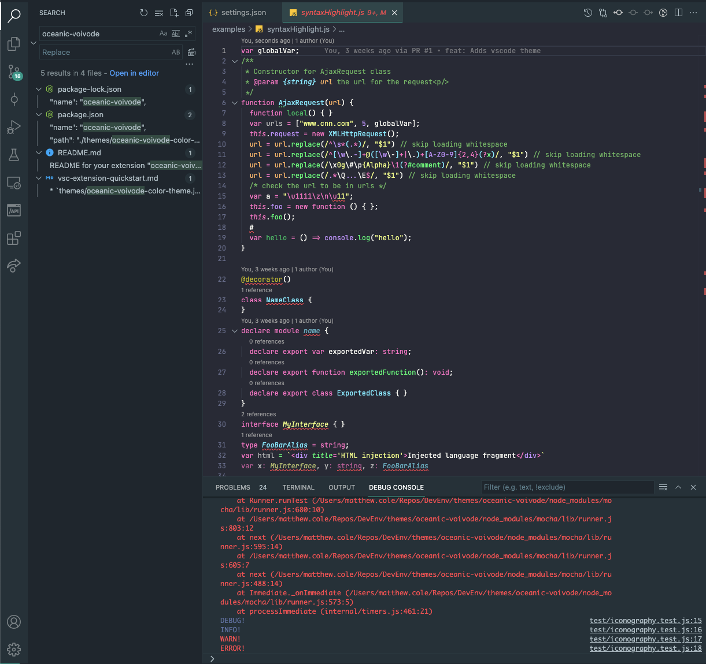

# Oceanic Voivode for Visual Studio Code

### A dark theme for Visual Studio Code, inspired by [Material Oceanic](https://marketplace.visualstudio.com/items?itemName=Equinusocio.vsc-material-theme) and [Dracula](https://marketplace.visualstudio.com/items?itemName=dracula-theme.theme-dracula).

This theme also bundles the following extensions for greater theming and token colorisation:
  
  - [Material Icon Theme](https://marketplace.visualstudio.com/items?itemName=PKief.material-icon-theme)
  - [string-highlight](https://marketplace.visualstudio.com/items?itemName=Jenkey2011.string-highlight)

---

Please check the official documentation, [Theme Color Reference](https://code.visualstudio.com/api/references/theme-color) and [Color Themes](https://code.visualstudio.com/docs/getstarted/themes), for more helpful information.
